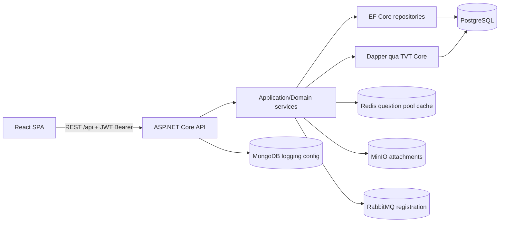

# ExamHub — Context cho AI/GPT

> Cập nhật từ mã nguồn đang có ngày **2026-09-16**. Đây là bản đồ nhanh để một AI hoặc lập trình viên mới hiểu dự án trước khi sửa code. Khi tài liệu và code khác nhau, ưu tiên code, migration/schema và test hiện tại.

## 1. Mục tiêu sản phẩm

ExamHub là hệ thống quản lý ngân hàng câu hỏi và tổ chức thi cho trường học, phục vụ ba vai trò:

- **Admin**: quản lý người dùng, trường, khóa học, lớp học, danh mục và phân công.
- **Teacher**: quản lý/duyệt câu hỏi, mẫu đề, sinh đề, tạo kỳ thi và chấm bài.
- **Student**: xem kỳ thi được giao, chọn hoặc được bốc đề, làm bài, lưu tiến độ và xem kết quả.

Năng lực nghiệp vụ chính:

1. Phân loại câu hỏi theo lớp, môn, chủ đề, loại câu hỏi, độ khó và cấp độ nhận thức Bloom.
2. Tạo `ExamTemplate` gồm nhiều section và sinh một hoặc nhiều biến thể đề.
3. Lưu snapshot câu hỏi/đáp án vào đề để việc sửa ngân hàng câu hỏi không làm thay đổi đề đã sinh.
4. Giao kỳ thi cho cả khóa hoặc lớp cụ thể, giới hạn thời gian và số lượt làm.
5. Tự chấm câu khách quan, chờ giáo viên chấm câu tự luận, sau đó tổng hợp điểm.

## 2. Cấu trúc repository

```text
ExamHub/
├── exam_hub_api/                 # Backend .NET 10
│   ├── ExamHub.API/              # HTTP API, controller, auth policy, middleware entry point
│   ├── ExamHub.Core/             # Domain, DTO, service, repository, EF Core, cache
│   ├── ExamHub.Tests/            # xUnit unit/service tests
│   ├── database_schema.sql       # Schema + seed/bootstrap cho PostgreSQL
│   ├── compose.yaml              # Hạ tầng local
│   └── Directory.Packages.props  # Quản lý phiên bản NuGet tập trung
├── exam_hub_web/                 # React SPA
│   ├── src/pages/                # Màn hình theo nghiệp vụ
│   ├── src/hooks/queries/        # TanStack Query hooks
│   ├── src/services/             # HTTP service theo resource
│   ├── src/stores/               # Zustand stores
│   └── src/types/                # TypeScript ambient declarations
├── seed/                         # Dữ liệu mẫu và công cụ sinh/import
├── uml/                          # Use case, activity, sequence, ERD và tài liệu báo cáo
├── docs/superpowers/             # Spec/plan triển khai trước đây
├── context.md                    # Tài liệu cũ, có một số số liệu không còn đúng
└── context-gpt.md                # Tài liệu hiện tại này
```

Quy mô source tại thời điểm khảo sát:

- API: khoảng 36 file / 2.438 dòng C#.
- Core: khoảng 190 file / 11.998 dòng C#.
- Tests: 19 file / 2.264 dòng C#, hiện có 82 test chạy qua.
- Web `src`: khoảng 130 file / 11.531 dòng TypeScript/TSX/CSS.
- HTTP API: 23 controller có khoảng 129 endpoint khai báo trực tiếp.

## 3. Kiến trúc tổng thể



### Backend

- Runtime: **.NET 10 / ASP.NET Core**.
- Solution: `exam_hub_api/ExamHub.API.slnx`.
- `ExamHub.API/Program.cs` cấu hình controller, global exception handler, OpenAPI/Scalar ở Development, JWT auth, fallback policy bắt buộc đăng nhập, CORS và middleware từ TVT Core.
- `ExamHub.Core` gộp các phần Domain, Application và Infrastructure trong một project:
  - `Domain/Entities`: entity nghiệp vụ.
  - `Domain/Interfaces`: repository/service contracts.
  - `DataTransferObjects`: request/response API.
  - `Infrastructure/Persistence/Repositories`: EF Core và Dapper access.
  - `Infrastructure/Persistence/Services`: nghiệp vụ ứng dụng.
  - `Infrastructure/Caching`: quy ước cache pool câu hỏi.
- `AppDbContext` dùng PostgreSQL, snake_case naming, enum converter và Fluent API.
- Các project backend tham chiếu source ngoài repository tại `../trungtv_core`; máy build phải có sibling repository này đúng vị trí.

### Frontend

- **React 19**, **TypeScript 5.9**, **Vite 7**, **React Router 7**.
- UI: Ant Design 6, Tailwind CSS 4, KaTeX, TipTap, Recharts.
- Server state: TanStack React Query; mặc định `staleTime = 60s`, retry một lần.
- Client/auth state: Zustand với persistence.
- `requestService.ts` tạo `Http` và `AuthHttp`, ghép URL theo `VITE_API_BASE + /api`, timeout 15 giây và thêm Bearer token.
- Routing nằm tại `src/routes/index.tsx`; admin/teacher đi qua `ProtectedRoute` + `AppLayout`, student dùng `StudentLayout`, còn luồng làm bài full-screen là các route riêng.
- Trang gọi query hook; hook gọi service; service gọi `requestService`; response được cache/invalidate bằng React Query.

## 4. Mô hình miền

PostgreSQL hiện có **25 bảng** trong `database_schema.sql` (gồm `app_users`). Các nhóm chính:

| Nhóm | Entity/bảng | Ý nghĩa |
|---|---|---|
| Identity | `AppUser` | Tài khoản, role Admin/Teacher/Student, JWT/refresh token |
| Nội dung | `GradeLevel`, `Subject`, `Topic` | Cấp lớp → môn → cây chủ đề |
| Phân loại | `DifficultyLevel`, `QuestionType`, `CognitiveLevel` | Độ khó, hình thức câu hỏi, Bloom |
| Ngân hàng | `Question`, `QuestionAnswer` | Nội dung câu hỏi và đáp án gốc |
| Tổ chức | `School`, `Cohort`, `CohortClass` | Trường → khóa tuyển sinh → lớp thực tế |
| Thành viên | `SchoolMember`, `CohortMember` | Giáo viên/admin thuộc trường; học sinh thuộc khóa |
| Phân công | `TeacherSubject`, `CohortClassTeacher` | Giáo viên phụ trách môn và lớp/môn |
| Soạn đề | `ExamTemplate`, `ExamTemplateSection` | Cấu hình tái sử dụng để sinh đề |
| Đề thi | `Exam`, `ExamQuestion` | Đề cụ thể và snapshot câu hỏi/đáp án |
| Kỳ thi | `ExamSession`, `ExamSessionExam`, `ExamSessionAssignment` | Kỳ thi, pool đề và đối tượng được giao |
| Bài làm | `ExamSubmission`, `SubmissionAnswer` | Lượt làm và câu trả lời của học sinh |

Quan hệ quan trọng:

```text
GradeLevel 1 ── * Subject 1 ── * Topic 1 ── * Question 1 ── * QuestionAnswer
ExamTemplate 1 ── * ExamTemplateSection
ExamTemplate 1 ── * Exam 1 ── * ExamQuestion
ExamSession * ── * Exam          (qua ExamSessionExam)
ExamSession 1 ── * Assignment    (Cohort hoặc CohortClass)
Exam 1 ── * ExamSubmission 1 ── * SubmissionAnswer
School 1 ── * Cohort 1 ── * CohortClass
AppUser * ── * School/Cohort/Subject qua các bảng liên kết
```

### Thuật ngữ phải dùng đúng

- `GradeLevel`: cấp lớp trừu tượng (lớp 10), không phải lớp 10A.
- `Cohort`: khóa tuyển sinh theo năm tại một trường.
- `CohortClass`: lớp thực tế trong một khóa.
- `QuestionAnswer`: đáp án chuẩn của câu hỏi.
- `SubmissionAnswer`: câu trả lời của học sinh.
- `ExamTemplate`: cấu hình sinh đề; `Exam`: đề đã materialize.
- `Batch`: nhóm biến thể đề chung `batch_id`, không phải `Cohort`.

## 5. Luồng nghiệp vụ chính

### 5.1 Xác thực và phân quyền

1. Login trả access token + refresh token.
2. Frontend giải mã claims để tạo `UserInfo`, lưu auth state bằng Zustand persistence.
3. Backend có fallback policy `RequireAuthenticatedUser`; chỉ login/register/refresh được đánh dấu anonymous.
4. Phân quyền dùng role (`Admin`, `Teacher`, `Student`) và resource policies:
   - `TeacherOwnsSubject`
   - `TeacherOwnsCohortClass`
5. Claims phạm vi gồm school, cohort class và subject; `CurrentUserInfo` parse các claim này.

### 5.2 Ngân hàng câu hỏi

1. Câu hỏi gắn với Topic, QuestionType, DifficultyLevel và CognitiveLevel tùy chọn.
2. Có CRUD, lọc/phân trang, import Excel, upload ảnh/PDF/audio lên MinIO.
3. Trạng thái review hỗ trợ verify, unverify và reject.
4. Pool ID câu hỏi hợp lệ được cache Redis 2 phút theo subject/topic + difficulty + type + cognitive level.
5. Thêm/sửa/xóa/duyệt câu hỏi phải invalidation các key pool liên quan.

### 5.3 Tạo mẫu và sinh đề

1. `ExamTemplate` chứa nhiều `ExamTemplateSection`.
2. Mỗi section định nghĩa topic, loại câu hỏi, Bloom tùy chọn, số câu, điểm/câu và phần trăm 4 mức khó.
3. `ExamGeneratorService` chia số câu bằng largest-remainder, lấy ngẫu nhiên từ pool, chống trùng trong cùng lượt/lô và có thể shuffle câu/đáp án.
4. Đề sinh ra ở trạng thái `Draft`; mỗi `ExamQuestion` giữ snapshot nội dung và đáp án JSON.
5. Batch hỗ trợ tối đa 20 biến thể, dùng `batch_id`, `parent_exam_id`, `variant_index`.

### 5.4 Kỳ thi và làm bài

1. Admin/Teacher tạo `ExamSession`, thêm đề vào pool và giao cho Cohort/CohortClass.
2. Session có trạng thái `Draft → Published → Closed`, thời gian mở/đóng, `MaxAttempts` và cách chọn đề:
   - `Random`: hệ thống bốc đề.
   - `StudentChoice`: học sinh chọn đề chưa làm trong pool.
3. Khi bắt đầu, backend kiểm tra assignment, cửa sổ thời gian và số lượt; tạo `ExamSubmission` trạng thái `InProgress`.
4. Frontend lưu tiến độ bằng cách thay thế tập đáp án hiện tại.
5. Khi nộp, câu khách quan được tự chấm từ snapshot; có câu cần chấm tay thì trạng thái là `PendingManualGrade`, nếu không bài được chuyển thẳng sang `Graded`.
6. Teacher chấm từng câu tự luận và finalize để cập nhật `total_score`, trạng thái `Graded`.

## 6. API theo nhóm

Base URL phía web lấy từ `VITE_API_BASE`; mọi service tự thêm prefix `/api`.

| Prefix | Chức năng |
|---|---|
| `/api/Auth` | Login, register, refresh, profile, đổi mật khẩu |
| `/api/Menu` | Menu theo role |
| `/api/users` | Quản trị user, role, khóa/mở, reset password, bulk import |
| `/api/questions` | Ngân hàng câu hỏi, review, import, attachment |
| `/api/exam-templates` | Mẫu đề và section |
| `/api/exam-generator` | Sinh một đề hoặc batch |
| `/api/exams` | Danh sách/chi tiết, publish/archive, analytics, export |
| `/api/exam-sessions` | Session, pool đề, assignments, publish/close, luồng student |
| `/api/exam-submissions` | Nộp bài, autosave, chấm, finalize |
| `/api/School`, `/api/Cohort`, `/api/CohortClass` | Cấu trúc trường/lớp |
| `/api/SchoolMember`, `/api/CohortMember` | Thành viên |
| `/api/teacher-subjects`, `/api/cohort-class-teachers` | Phân công giáo viên |
| Các controller category | GradeLevel, Subject, Topic, QuestionType, DifficultyLevel, CognitiveLevel |

Development expose OpenAPI và Scalar tại `/openapi/...` và `/docs` theo cấu hình trong `Program.cs`.

## 7. Hạ tầng và lưu trữ

`exam_hub_api/compose.yaml` hiện khai báo:

- PostgreSQL 17
- Redis
- MinIO
- RabbitMQ
- MongoDB

API/frontend/nginx trong compose đang bị comment, nên compose hiện chỉ dựng dependency. Volume PostgreSQL được khai báo cuối file nhưng chưa mount vào service; MinIO volume cũng đang comment.

Nguồn schema hiện tồn tại song song:

- EF Core migration trong `ExamHub.Core/Infrastructure/Persistence/Migrations`.
- `database_schema.sql`, được compose mount vào PostgreSQL init.

## 8. Build, chạy và kiểm thử

### Backend

Yêu cầu .NET SDK 10 và sibling repo `D:/My-Project/trungtv_core`.

```powershell
cd exam_hub_api
docker compose up -d
dotnet restore ExamHub.API.slnx
dotnet run --project ExamHub.API
dotnet test ExamHub.API.slnx
```

Kết quả kiểm chứng ngày 2026-09-16: **82/82 test backend pass**. Restore/build vẫn có warning về package dễ bị tổn thương và `EFCore.NamingConventions 9.0.0` không đúng constraint của EF Core 10.

### Frontend

```powershell
cd exam_hub_web
pnpm install
pnpm dev
pnpm lint
pnpm build
```

Kết quả kiểm chứng ngày 2026-09-16:

- `pnpm build`: pass.
- Bundle JS chính: khoảng **2,702 kB**, gzip khoảng **815 kB**; Vite cảnh báo chunk lớn.
- `pnpm lint`: fail với 7 error và 2 warning.
- Chưa có test runner/test frontend trong `package.json`.

## 9. Quy ước khi sửa code

- Repository trong `ExamHub.Core` không tự tạo `NpgsqlConnection`; dùng repository abstractions của TVT Core hoặc EF `AppDbContext` theo pattern sẵn có.
- Query chỉ đọc nên dùng `AsNoTracking` hoặc projection.
- Truyền `CancellationToken` xuyên suốt controller → service → repository.
- Dùng UTC cho thời gian backend; API gửi timestamp milliseconds ở các DTO hiện tại.
- Không sửa câu hỏi gốc để thay đổi đề đã sinh; `ExamQuestion` là snapshot.
- Không tin role/menu phía frontend để bảo vệ dữ liệu; backend phải kiểm tra role và resource ownership.
- Khi thay đổi question classification/status, giữ đúng chiến lược invalidation Redis.
- Thay đổi schema phải cập nhật một nguồn migration chuẩn, test constraint/index và đồng bộ cách bootstrap local.
- Không đưa secret, token, connection string thật hoặc credentials vào tài liệu/log/commit.

## 10. Bản đồ file quan trọng

| Cần tìm | File/thư mục |
|---|---|
| API bootstrap | `exam_hub_api/ExamHub.API/Program.cs` |
| DI backend | `exam_hub_api/ExamHub.Core/DependencyContainer.cs` |
| EF model | `exam_hub_api/ExamHub.Core/Infrastructure/Persistence/AppDbContext.cs` |
| Schema bootstrap | `exam_hub_api/database_schema.sql` |
| Sinh đề | `.../Services/Implementations/ExamGeneratorService.cs` |
| Kỳ thi | `.../Services/Implementations/ExamSessionService.cs` |
| Nộp/chấm bài | `.../Services/Implementations/ExamSubmissionService.cs` |
| Chọn câu hỏi/cache | `.../Repositories/Implementations/QuestionRepository.cs`, `Infrastructure/Caching/QuestionPoolCache.cs` |
| Auth frontend | `exam_hub_web/src/stores/authStore.ts`, `src/services/authService.ts` |
| HTTP frontend | `exam_hub_web/src/services/requestService.ts` |
| Router | `exam_hub_web/src/routes/index.tsx`, `src/routes/paths.ts` |
| Query hooks | `exam_hub_web/src/hooks/queries/` |
| Test backend | `exam_hub_api/ExamHub.Tests/` |

## 11. Điểm cần biết trước khi phát triển tiếp

- `README.md` ở root gần như chưa có nội dung; tài liệu chạy dự án thực tế nằm rải rác.
- `context.md` cũ mô tả 15 bảng lõi và một số thiết kế trước đây; không nên dùng số liệu đó thay cho schema hiện tại.
- Frontend có cả `package-lock.json` và `pnpm-lock.yaml`; source hiện được kiểm tra bằng pnpm.
- Backend phụ thuộc chặt vào `trungtv_core` ngoài repository, nên clone riêng ExamHub chưa đủ để build.
- Danh sách tối ưu và rủi ro đã được ghi tại [`system-optimizations.md`](./system-optimizations.md).
